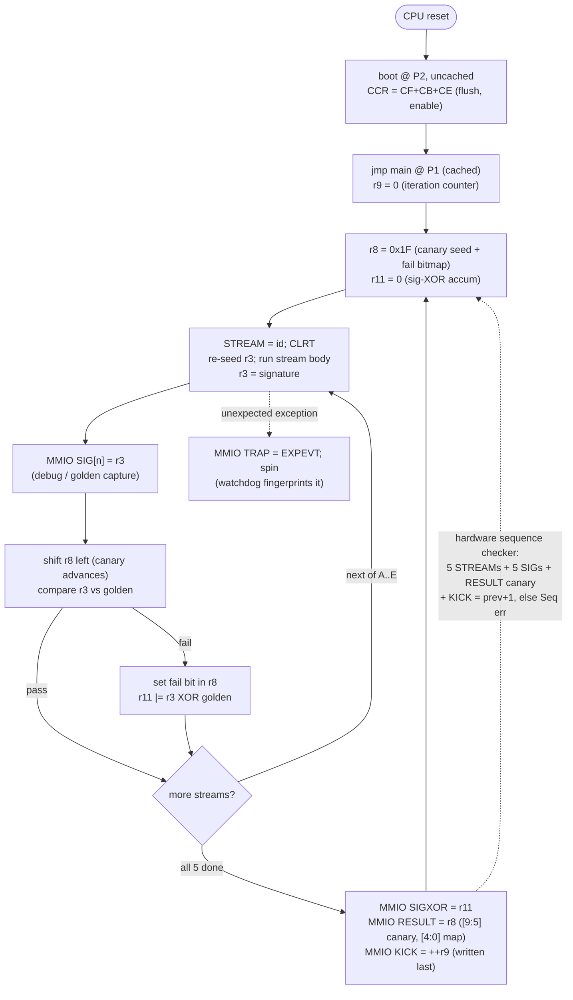
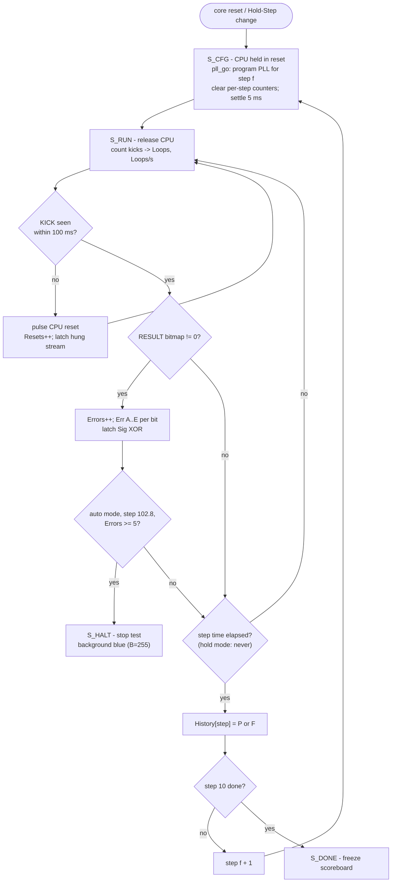

# MiSTerSH3Test-CV1k

**Most people have reported that it runs stably at 102.8MHz 
and can reach up to 133MHz. Cyclone V / speed grade I7**

**You may report the run result [here](https://forms.gle/6qDeANcCHS294PX57)**.

SH-3 (HS3 core) Fmax stress suite for ikacore_CV1k. Fork of
`benchmarks/MiSTerDDR3Test-CV1k` (itself a fork of
[MiSTerDDR3Test](https://github.com/RobertPeip/MiSTerDDR3Test),
(c) FPGAzumSpass / Robert Peip, GPLv3): the DDR3 engine is replaced by the
**full HS3 chip top** (pipeline + cache + I-bus fabric + BSC; INTC/DMAC/
TMU/RTC/ports present but idle) running a cache-resident stress program,
stepped through a frequency schedule by an on-chip manager. Instantiating
the whole chip — not just `cpu_core` — keeps the fitted footprint, and
therefore the slack, representative of the real integration. Program memory
and the test MMIO hang off the BSC's physical pin bus like board devices
(CS0 / CS4); the generic memory port is tied off exactly like the board top
(`i_MEM_READY=0`).

**Goal:** the SH-3 core is stable at 78–82 MHz today; CV1k needs **102.8 MHz**.
This suite reports, per frequency, whether the core computes *wrongly*
(signature errors, split per critical-path family) or *hangs* (watchdog
resets, with the hung stream), so each fitter iteration gets silicon-truth
feedback about which path class breaks first.

## What runs on the CPU

`sw/make_prog.py` (built-in two-pass SH-3 mini-assembler; no toolchain
needed) generates a 16 KB BRAM image. Boot enables the cache
(CCR = CF|CB|CE) from P2 and jumps to P1; the steady-state loop is fully
cache-resident (zero external accesses except the uncached MMIO reports).
Five streams, each aimed at a documented HS3 critical-path family
(fit4/6/8/9/10 annotations in the core RTL):

| Stream | Target paths |
|---|---|
| **A** | SHAD/SHLD dynamic barrel (dominant EX path) + EX forward mux, both legs freshly forwarded, direction flipped every pair, ROTCL T-chain |
| **B** | load-use / aligner / AGU: pointer chase where the loaded word is the next indexed EA, signed byte + word aligner legs, pre-dec stores, PREF allocate, ADDC carry chain |
| **C** | MAC/DSP: MAC.W memory operands (`bram_addr -> dsp_b`, fit8), DMULS.L/MUL.L/MULS.W with forwarded operands, STS MACL at the `id_uses_mac_state` boundary |
| **D** | DIV0S/DIV1 carry chain (r_m/r_q/T running flags), compare -> BT/BF back-to-back (T folds into the AGU enable), DT;BF idiom |
| **E** | decode/hazard churn at IPC 1: register fields, formats and forward distances 1/2/3 permuted so every forward lane + dst-compare toggles each cycle |

### Stream bodies (as assembled)

Register conventions: `r1` data base, `r2` MMIO base, `r3` stream signature,
`r8` canary+fail bitmap, `r9` iteration counter, `r10` inner loop counter,
`r11` Sig-XOR accumulator, `r13` pre-dec scratch. Every stream is entered as
`STREAM=id` → `CLRT` → body, and left through the shared check epilogue at
the bottom. Snippets below are the actual generated code (`sw/make_prog.py
--listing`); literals shown symbolically.

**A — dynamic barrel shifter + EX forward mux** (both SHAD/SHLD legs get
freshly forwarded data, direction flips every pair):

```asm
        mov.l   @(lit,pc),r3    ! seed 0x9E3779B9
        mov.l   @(lit,pc),r6    ! seed 0x0F1E2D3C
        mov     #64,r10
A1:     add     r3,r6           ! producer in EX
        shad    r6,r3           ! amount AND operand forwarded (G0 leg)
        neg     r6,r7           ! sign flip -> next shift reverses direction
        shld    r7,r3
        xor     r6,r3
        add     r7,r6
        shad    r3,r6           ! roles swapped
        shld    r6,r3
        rotcl   r6              ! T-chain through the shifter results
        dt      r10
        bf      A1
        xor     r6,r3
```

**B — load-use / aligner / AGU pointer chase** (the loaded word is the next
indexed effective address; likely the longest architectural loop):

```asm
        mov     #0,r3           ! signature seed (entropy from the loads)
        mov     #0,r0           ! chase offset
        mov     #48,r10         ! r1 = ring base, r13 = scratch top
B1:     mov.l   @(r0,r1),r0     ! ring[r0] -> next EA   (load -> AGU)
        mov.l   @(r0,r1),r4     ! dependent indexed load, same EA
        add     r4,r3           ! load-use into the ALU
        mov.b   @(r0,r1),r5     ! signed byte: aligner sign-extend leg
        addc    r5,r3           ! carry chain across iterations
        rotl    r3              ! spread the sum over all 32 bits
        mov.l   r3,@-r13        ! pre-dec store, store-data forward leg
        xor     r4,r5
        mov.l   r5,@-r13
        pref    @r13            ! PREF allocate on the descending line
        mov.w   @(r0,r1),r6     ! word load: the other aligner leg
        xor     r6,r3
        dt      r10
        bf      B1
        xor     r0,r3           ! fold the final chase position
```

**C — MAC/DSP** (memory operands straight into the multiplier — the fit8
`bram_addr -> dsp_b` wall — then forwarded-operand multiplies against the
MAC-state interlock):

```asm
        clrmac
        mov.l   @(lit,pc),r4    ! word table 0x80002400
        mov.l   @(lit,pc),r5    ! word table 0x80002440
        mov     #0,r3
        mov     #32,r10
C1:     mac.w   @r4+,@r5+       ! memory operand -> dsp_b, x128
        mac.w   @r4+,@r5+
        mac.w   @r4+,@r5+
        mac.w   @r4+,@r5+
        dt      r10
        bf      C1
        sts     macl,r6
        xor     r6,r3
        sts     mach,r7
        xor     r7,r3
        mov     r6,r12
        mov     #16,r10
C2:     add     r3,r12
        dmuls.l r12,r6          ! forwarded operands into the DSP capture regs
        sts     macl,r7         ! earliest legal read: id_uses_mac_state boundary
        xor     r7,r3
        muls.w  r7,r12
        sts     macl,r14
        add     r14,r3
        mul.l   r3,r6
        sts     macl,r6
        dt      r10
        bf      C2
        xor     r6,r3
```

**D — DIV1 carry chain / T-chain / compare-then-branch** (T feeds the AGU's
conditional-branch addend enable; includes the DT;BF idiom):

```asm
        mov.l   @(lit,pc),r3    ! dividend 0x7FF12345
        mov.l   @(lit,pc),r6    ! divisor  0x000F4240
        mov.l   @(lit,pc),r7    ! 0xA5A5A5A5
        mov     #16,r10
D1:     div0s   r6,r3           ! initialize M/Q/T
        div1    r6,r3           ! 33-bit add/sub, M/Q/T running flags
        div1    r6,r3
        rotcl   r7              ! T-chain interleave
        div1    r6,r3
        div1    r6,r3
        rotcl   r7
        div1    r6,r3
        div1    r6,r3
        cmp/pz  r7              ! compare immediately before the branch:
        bt/s    D2              !   T folds into the AGU addend enable
        xor     r6,r3           ! delay slot (executes on both paths)
        add     r7,r3           ! not-taken arm
        rotl    r6
D2:     rotcl   r3
        movt    r0
        add     r0,r7
        tst     r0,r0           ! data-dependent taken pattern
        bf      D3
        xor     r7,r3
D3:     dt      r10
        bf      D1
        xor     r7,r3
```

**E — decode/hazard churn at IPC 1** (96 single-cycle ops per pass over 7
registers; opcodes, register fields and forward distances 1/2/3 are permuted
by a fixed-seed PRNG in the generator, so every forward lane and dst-compare
toggles each cycle — excerpt):

```asm
        mov     #8,r10          ! r3..r7,r12,r14 seeded from literals
E1:     shll2   r14
        extu.b  r6,r6
        not     r7,r5
        rotcr   r3
        sub     r5,r12          ! distance-1 consumer of the r5 producer
        shlr    r7
        rotl    r12
        not     r5,r5
        addc    r5,r6           ! T rides between ops
        add     r5,r7
        shar    r6
        ...                     ! 96 ops per pass, PRNG-permuted
        add     r10,r3          ! loop-counter mix-in: no fixed points
        rotl    r3
        dt      r10
        bf      E1
        xor     r4,r3           ! fold r4,r5,r6,r7,r12,r14 into r3
        rotl    r3              !   (xor + rotl per register)
        ...
```

**Shared check epilogue** (every stream ends here — this is where the
signature verdict, the canary advance, and the Sig-XOR capture happen):

```asm
        mov.l   r3,@(SIGn,r2)   ! raw signature -> MMIO (debug / golden capture)
        mov.l   @(lit,pc),r7    ! golden signature
        shll    r8              ! advance the execution canary
        cmp/eq  r7,r3
        movt    r0
        xor     #1,r0           ! r0 = 1 on mismatch
        or      r0,r8           ! fail bit into RESULT[4:0]
        mov     r3,r6
        xor     r7,r6           ! diff vs golden
        neg     r0,r5           ! all-ones mask when failing
        and     r5,r6
        or      r6,r11          ! accumulate Sig XOR (masked unless failing)
```

Each stream folds every result into a 32-bit signature compared against a
**golden** captured by running the same program on the same RTL in Verilator
(`verify/run_cpu.sh`). Per iteration the program writes, to uncached MMIO:
the signature XOR, then the RESULT word, then the **watchdog kick** (that
order on purpose — the manager samples the XOR on the RESULT toggle). An
unexpected exception reports EXPEVT and spins (the watchdog then
fingerprints it).

**Execution proof (anti-false-negative).** The fail bitmap is not
pass-by-default: the loop seeds `r8 = 0x1F` and every check *shifts* it, so
after exactly five checks the seed lands in RESULT[9:5] as a canary
(`11111`) with the fail bits in [4:0]. A hardware sequence checker in
`sh3test_cpu.sv` additionally verifies, per kick-to-kick window: all five
STREAM markers, all five SIG writes, a RESULT with an intact canary, and a
KICK payload that increments by exactly 1 (first kick after a CPU reset
exempt). Any violation raises a **Seq err** — so a control-flow fault that
skips streams or checks (which a pass-by-default bitmap would report as a
clean loop) is flagged instead of silently passing. Validated by fault
injection: a 1-bit data fault → `Err ABCDE` only; a skipped stream →
canary/SIG violation every iteration; a stuck iteration counter →
kick-monotonicity violation only.



## Schedule / manager (`rtl/sh3test_mgr.sv`, 50 MHz)

| Steps | Duration |
|---|---|
| 75 / 80 / 85 / 90 MHz | 1 min each |
| 95 / 100 MHz | 5 min each |
| 102.8 / 105 / 108 / 112 MHz | 10 min each |

- PLL runtime-reconfigured per step (fractional M, C0 = /8, VCO 600–896 MHz);
  CPU held in reset ~5 ms around each reconfig.
- **Watchdog**: no kick for 100 ms → CPU reset, tally + latch the stream that
  was running.
- **Halt rule**: ≥ 5 bad iterations (signature errors **+ sequence errors**)
  at the 102.8 MHz step (auto run) → test stops, background turns
  **blue (B=255)**.
- OSD **Hold Step** soaks one frequency indefinitely (halt rule off, time
  counts up) — for probing a single fit.
- Hold Step also exposes four **overdrive points outside the auto schedule**:
  120 / 133 / 150 / 166 MHz (VCO 720÷6, 665÷5, 750÷5, 830÷5 — the usual ÷8
  would exceed the 896 MHz VCO ceiling, so these steps lower C0 instead).
  Manual selection only; no history slot, and the step counter reads
  11/10–14/10. Expect the watchdog reset loop once the core stops booting.
- OSD open pauses the schedule + watchdog; counters are not cleared.



## Scoreboard

```
Frequency:  102.8 MHz  07/10    measured (crystal-referenced), step
Time:       09:42               remaining (auto) / elapsed (hold)
Loops:      0001234567          kicks this step
Loops / s:  0000020560          ~20k/s @100 MHz is the healthy rate
Resets:     0000000003 (B)      watchdog resets (hung stream in parens)
Errors:     0000000012          bad iterations this step
Err ABCDE:  00 0C 00 00 05      per-stream error counts (hex, saturate FF)
Sig XOR:    00420000            last bad-signature XOR vs golden
History:    PPPPPF>...          P pass / F fail / > running / . pending
Seq err:    0000000000          execution-proof violations (canary/protocol/
                                kick-monotonicity) — nonzero means the CPU
                                mis-executed control flow, not just data
```

Read `Err ABCDE` + `Resets` together: errors in B/C point at the load/aligner
and DSP-operand walls, A at the shifter/forward mux, D at the DIV/T chain,
E at decode/forwarding; resets (hangs) usually implicate fetch/branch paths.
`Sig XOR` bit positions often identify the failing byte lane / carry span.

## Building

```
python3 sw/make_prog.py        # regen rtl/sh3test_prog.hex (goldens from sw/goldens.json)
verify/seed_sweep.sh           # 6 seeds in parallel Docker containers, keep best slack
verify/seed_sweep.sh --map-only   # cheap smoke test: elaboration + synthesis only
```

`seed_sweep.sh` copies the project once per seed, runs six headless
`raetro/quartus:17.0` containers concurrently (Aggressive Performance
optimization mode), reads each build's CPU-clock setup slack out of the STA
report, copies the winner's `output_files/` + path reports back into the
project, and deletes the losers. `seed_sweep.txt` records the per-seed slack.
A single build is still just `quartus_sh --flow compile SH3Test`.

Two constructs Verilator accepts but **Quartus 17 does not**, both already
worked around — do not reintroduce them:

- Part-selecting a function-call result (`f(x)[7:0]`) is a syntax error.
- Writing byte lanes as part-selects of an *unpacked* word
  (`mem[a][31:24] <= ..`) silently blocks RAM inference: the 16 KB program
  memory becomes 131072 flip-flops. The array is declared `reg [3:0][7:0]`
  and written `mem[a][3] <= ..` so it infers as an M10K `altsyncram` whose
  `INIT_FILE` Quartus generates from the `$readmemh`.

The HS3 IP lives as a **local copy** at `HS3/` (per project convention).
After changing the IP, re-sync it before building or simulating:

```
rm -rf HS3 && cp -rL ../../sim/ip_cores/HS3 HS3 && rm -rf HS3/cpu_core/obj_dir
```

Timing is constrained at the 102.8 MHz target (`SH3Test.sdc`); the
105/108/112 steps measure real margin beyond closure.

## Verification (Verilator 5, --timing)

```
verify/run_cpu.sh              # program on the real core: boot, cache enable,
                               #   golden capture -> re-run, RESULT==0, kicks
verify/run_cpu.sh --recapture  # after changing the program
verify/run_engine.sh           # SIM_SPEEDUP full engine: clean 10-step run
                               #   (history all-P), alarm path at 102.8,
                               #   watchdog unit test
```

After **any change to `sw/make_prog.py`**, run `verify/run_cpu.sh --recapture`
(new goldens) and rebuild the FPGA image — program and goldens must be from
the same generation.

## Memory map (CPU view)

| Address | BSC | Use |
|---|---|---|
| `0xA0000000` | CS0 (area 0, 32-bit) | boot (P2, uncached; phys 0 in BRAM) |
| `0x80000180` | CS0 | main loop (P1, cached) |
| `0x80002000+` | CS0 | data tables (chase ring, MAC table, scratch) |
| `0xB0000000+` | CS4 (area 4) | test MMIO: +0 KICK, +4 RESULT, +8 SIGXOR, +C STREAM, +10 TRAP, +20..30 SIG[0..4] |

Area 0 width is strapped 32-bit (`MD4=MD3=1`); the BSC's reset-default
maximum wait states (WCR2) time every external cycle, which only affects
miss/boot latency — the steady-state loop is cache-resident (first kick
after reset ≈ 190 µs at 100 MHz, well inside the 100 ms watchdog).
